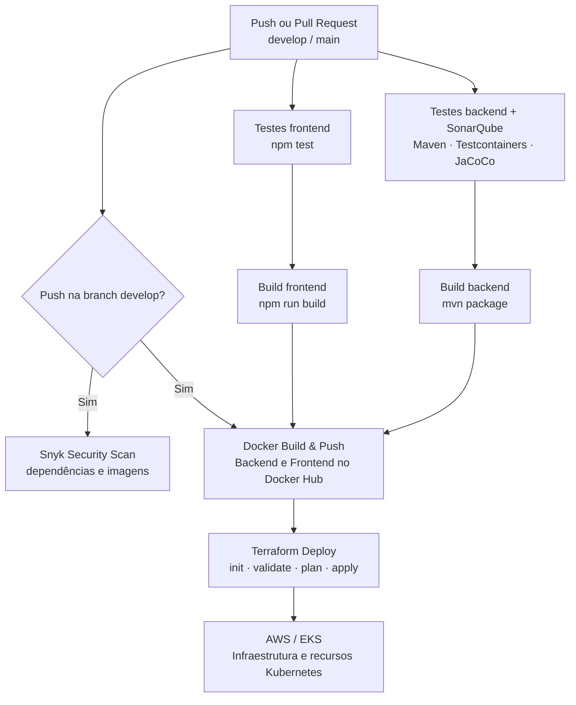

# AutoFlow

Sistema de gerenciamento de ordens de serviço para oficinas mecânicas. Controla o ciclo completo de atendimento:
abertura de OS, diagnóstico, orçamento, execução e encerramento, com controle de acesso por perfil e área do cliente.

---

## Estrutura do Repositório

```
autoflow/
├── backend/    # API REST — Java 21 + Spring Boot
└── frontend/   # SPA — Angular 17 + Angular Material
```

---

## Documentação do Projeto

Este README é o ponto de entrada da entrega. Para os detalhes técnicos, consulte:

- [Backend](backend/README.md): API Spring Boot, configuração, testes, Swagger e Docker.
- [Frontend](frontend/README.md): aplicação Angular, rotas, configuração e execução.
- [Arquitetura do backend](docs/architecture.md).
- [Diagramas de sequência](docs/diagramas-sequencia/diagrama-sequencia.md).
- [Fluxo de orçamento público](docs/fluxo-orcamento-publico.md).
- [Contrato OpenAPI versionado](docs/openapi/autoflow-api.json) e [documentação da API](docs/openapi/README.md).

---

## Stack

Java 21 e Spring Boot; Angular; PostgreSQL; Docker; Kubernetes; Terraform; GitHub Actions; OpenAPI/Swagger;
JUnit, SonarQube e Snyk.

---

## Arquitetura

### Backend — Clean Architecture

O AutoFlow é um monólito Spring Boot organizado segundo a Clean Architecture. O backend possui as camadas
`presentation`, `application`, `domain`, `infrastructure` e `config`.

A direção principal das dependências é `presentation → application → domain`. A camada `infrastructure` implementa
detalhes técnicos e as portas definidas pela `application`, enquanto `config` realiza a composição da aplicação.

Os detalhes da organização e das regras arquiteturais estão em [`docs/architecture.md`](docs/architecture.md).

### Frontend — Angular Standalone + Signals

O frontend usa componentes standalone, lazy loading, Signals, guards funcionais e interceptors JWT. Para rotas,
estrutura e instruções específicas, consulte o [README do frontend](frontend/README.md).

---

## Funcionalidades

O sistema oferece cadastro de clientes, veículos, serviços e peças; abertura e execução de ordens de serviço;
orçamentos com PDF e aprovação autenticada ou pública; reparos adicionais; notificações por e-mail; e área do cliente.

---

## Usuários e perfis de demonstração

Para a demonstração local da pós-graduação, o seed cria as contas abaixo. Todas usam a senha de exemplo `Senha@1234`:

| E-mail                   | Perfil      |
|--------------------------|-------------|
| `admin@autoflow.com`     | `ADMIN`     |
| `atendente@autoflow.com` | `ATENDENTE` |
| `mecanico1@autoflow.com` | `MECANICO`  |
| `mecanico2@autoflow.com` | `MECANICO`  |
| `cliente@autoflow.com`   | `CLIENTE`   |

São credenciais de demonstração acadêmica/local e não devem ser usadas em produção.

---

## Principais Fluxos

O sistema cobre o ciclo completo da OS, geração e aprovação de orçamentos, download de PDF, reparos adicionais e
acompanhamento público por token. Consulte os [diagramas de sequência](docs/diagramas-sequencia/diagrama-sequencia.md)
e o [fluxo de orçamento público](docs/fluxo-orcamento-publico.md) para os detalhes.

Para rotas, estrutura e instruções específicas da aplicação web, consulte o [README do frontend](frontend/README.md).

---

## Execução local

Pré-requisitos: Java 21, Maven, Node.js 20, npm, PostgreSQL e, opcionalmente, Docker. Os detalhes de cada aplicação
estão nos READMEs do [backend](backend/README.md) e do [frontend](frontend/README.md).

```bash
# backend
cd backend
mvn spring-boot:run

# frontend, em outro terminal
cd frontend
npm install
npm start
```

O backend fica disponível em `http://localhost:8081` e o frontend em `http://localhost:4200`.

## Docker Compose

Na raiz do repositório, suba a stack completa com:

```bash
docker-compose up -d
```

## Kubernetes local

Os [manifestos Kubernetes da entrega](k8s/) e o perfil local em [k8s-local/](k8s-local/) estão versionados no
repositório. É necessário ter Minikube, Kind ou Kubernetes habilitado no Docker Desktop.

```bash
cd k8s-local
minikube start
kubectl apply -f configmap.yaml
kubectl apply -f secret.yaml
kubectl apply -f postgresql-service.yaml
kubectl apply -f postgresql-stateful.yaml
kubectl apply -f .
kubectl get pods
```

O frontend fica disponível em `http://localhost:30180` e o backend em `http://localhost:30080`.

---

## Terraform na AWS

O código está em [infra/](infra/). Com o Terraform e as credenciais da AWS configurados fora do repositório, execute:

```bash
cd infra
terraform init
terraform plan
terraform apply
```

---

## API e OpenAPI

O [contrato OpenAPI versionado](docs/openapi/autoflow-api.json) é o artefato distribuível da API; a [documentação da
API](docs/openapi/README.md) detalha seu uso. Com o backend em execução, acesse [`http://localhost:8081/swagger-ui.html`](http://localhost:8081/swagger-ui.html)
ou [`http://localhost:8081/v3/api-docs`](http://localhost:8081/v3/api-docs).

---

## Segurança

O acesso é controlado por JWT e perfis (`ADMIN`, `ATENDENTE`, `MECANICO` e `CLIENTE`), com endpoints públicos e
privados segregados. Não são mantidas credenciais, tokens ou valores reais de ambiente neste README.

---

## Qualidade de Código

Testes automatizados e análises de qualidade e segurança usam JUnit, SonarQube, JaCoCo e Snyk.

## Fluxo do CI/CD

O [pipeline do GitHub Actions](.github/workflows/pipeline.yml) executa testes, análises de qualidade e segurança,
builds do backend e frontend, criação e publicação de imagens Docker e deploy via Terraform em AWS/EKS.

```text
                     ┌─────────────────────┐
                     │     Pull Request    │
                     │  develop / main     │
                     └──────────┬──────────┘
                                │
                                ▼
                ┌──────────────────────────────┐
                │ Backend Tests + SonarQube    │
                │ - Maven                      │
                │ - Testcontainers             │
                │ - JaCoCo                     │
                │ - SonarQube Quality Gate     │
                └──────────────┬───────────────┘
                               │
              ┌────────────────┴────────────────┐
              ▼                                 ▼
    ┌──────────────────┐              ┌──────────────────┐
    │  Backend Build   │              │ Frontend Tests   │
    │  mvn package     │              │ npm test         │
    └────────┬─────────┘              └────────┬─────────┘
             │                                  │
             │                                  ▼
             │                         ┌──────────────────┐
             │                         │ Frontend Build   │
             │                         │ npm run build    │
             │                         └────────┬─────────┘
             │                                  │
             └────────────────┬─────────────────┘
                              │
                              ▼
                ┌──────────────────────────────┐
                │      Push na develop?        │
                └──────────────┬───────────────┘
                               │ Sim
                               ▼
                ┌──────────────────────────────┐
                │       Snyk Security Scan     │
                │ - Open Source dependencies   │
                │ - Docker image               │
                └──────────────┬───────────────┘
                               │
                               ▼
                ┌──────────────────────────────┐
                │      Docker Build & Push     │
                │                              │
                │  Backend → Docker Hub        │
                │  Frontend → Docker Hub       │
                └──────────────┬───────────────┘
                               │
                               ▼
                ┌──────────────────────────────┐
                │       Terraform Deploy       │
                │                              │
                │  Terraform Init              │
                │  Terraform Validate          │
                │  Terraform Plan              │
                │  Terraform Apply             │
                └──────────────┬───────────────┘
                               │
                               ▼
                     ┌────────────────────┐
                     │    AWS / EKS       │
                     │                    │
                     │ Infrastructure +   │
                     │ Kubernetes         │
                     └────────────────────┘
```

---

## Entrega — Tech Challenge Fase 2

### Objetivos da Fase 2

Evoluir o AutoFlow com Clean Architecture, testes automatizados, APIs operacionais, infraestrutura como código, CI/CD,
deploy em Kubernetes e escalabilidade automática.

### Arquitetura de deploy

O deploy combina GitHub Actions, Docker Hub, Terraform, AWS EKS, RDS PostgreSQL, ConfigMaps, Secrets e HPA. O HPA do
backend foi aplicado manualmente em produção para a demonstração, conforme o [manifesto k8s/hpa.yaml](k8s/hpa.yaml).



Consulte a [fonte Mermaid do diagrama](docs/diagramas-arquitetura/arquitetura-deploy-fase-2.mermaid) e a [documentação
detalhada da arquitetura de deploy](docs/diagramas-arquitetura/README.md).

### Evidências da entrega

- [Manifestos Kubernetes](k8s/)
- [Código Terraform](infra/)
- [Pipeline GitHub Actions](.github/workflows/pipeline.yml)
- [Contrato OpenAPI versionado](docs/openapi/autoflow-api.json)
- [Documentação da API](docs/openapi/README.md)
- [Vídeo demonstrativo da Fase 2](https://youtu.be/ObUkVeYQCOA)
